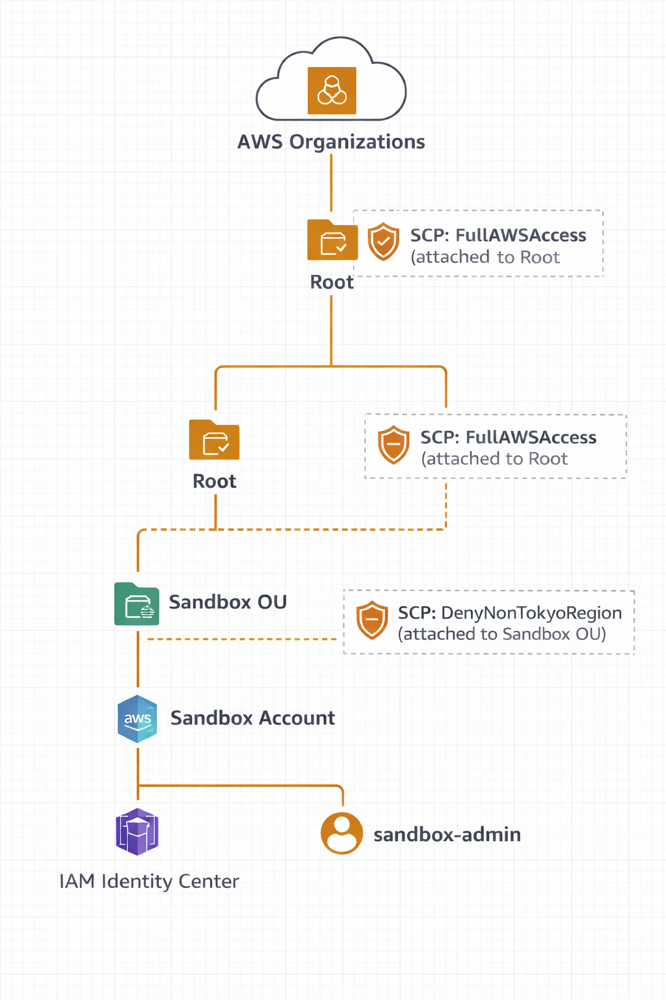

# AWS Organizations / SCP ポートフォリオ

## 概要
本リポジトリは、AWS Organizations 環境において、  
SCP（Service Control Policy）を用いたリージョン制御の設計と検証を行ったポートフォリオです。

SCP は Organizations 配下アカウントにおける許可の上限を定義する仕組みであり、  
本検証では Sandbox アカウントに対して東京リージョン以外の操作を制限しています。

また、IAM Identity Center を利用したアカウントアクセス管理と組み合わせることで、  
Organizations レベルでリージョン制御を行う構成としています。

---

## 構成
本検証では、以下の構成を採用しています。

- AWS Organizations
  - Root
  - OU（Sandbox）
  - Sandbox Account
- SCP
  - FullAWSAccess（前提となる許可上限）
  - DenyNonTokyoRegion（東京以外を拒否）
- IAM Identity Center
  - sandbox-admin ユーザー

### 構成図

なお、本検証では Sandbox OU を主対象としていますが、  
将来的な拡張を想定し、Security OU 等の空 OU も作成しています。

---

## 設計方針
- 個別の IAM ポリシーではなく、Organizations レベルで逸脱を防止するための制御を行う。
- Sandbox 環境では、東京リージョン以外の操作を完全に禁止する構成を採用する。
  （※ 本ポートフォリオでは「B構成」＝東京リージョン以外を SCP で一律 Deny する構成 と呼称）

---

## 使用した SCP

### FullAWSAccess
Sandbox アカウントには、AWS 管理の `FullAWSAccess` SCP を前提として適用しています。

本ポートフォリオでは理解しやすさを優先し、  
同等の内容を簡略化したポリシーを `scp/FullAWSAccess.json` に記載しています。

※ 実環境では AWS 管理の `FullAWSAccess` SCP を利用し、  
本 JSON は説明・検証用の簡略版として作成しています。

---

### DenyNonTokyoRegion
東京リージョン以外の操作を拒否するため、以下の条件を持つ SCP を適用しています。

- `aws:RequestedRegion` が `ap-northeast-1` 以外の場合は Deny
- グローバルサービスを考慮し、`Null` 条件を併用

詳細は `scp/DenyNonTokyoRegion.json` を参照してください。

---

## 検証手順
本検証は以下の手順で実施しました。

1. AWS Organizations にて Sandbox OU を作成
2. Sandbox アカウントを Sandbox OU 配下へ移動
3. Root または OU に `FullAWSAccess` SCP を適用
4. Sandbox OU に `DenyNonTokyoRegion` SCP をアタッチ
5. IAM Identity Center 経由で Sandbox アカウントへアクセス
6. 東京リージョン / 非東京リージョンで EC2 等の操作可否を確認

---

## 発生した問題と原因
検証中、Sandbox アカウントにおいて  
**東京リージョンでも EC2 が利用できない** という問題が発生しました。

原因は、Sandbox アカウントに `FullAWSAccess` SCP が付与されておらず、  
Deny 系 SCP のみが適用されていたことでした。

Organizations のポリシー一覧上で `FullAWSAccess` が Root にアタッチされている表示を確認し、  
Sandbox アカウントには個別に付与する必要がないと誤認して削除したことが原因です。

SCP は「許可の上限」を定義する仕組みであるため、  
Allow 系 SCP が存在しない状態では、結果としてすべての操作が拒否されます。

---

## 学び
- SCP は Allow ではなく「許可の上限」を定義する仕組みである
- Deny 系 SCP は `FullAWSAccess` を前提に設計する必要がある
- SCP 適用時の影響確認において、CloudTrail のイベント履歴を参照することで、  
  権限不足か SCP による拒否かを切り分ける判断材料になる
- SCP 変更時は、アタッチ先（Root / OU / Account）と影響範囲を事前に確認することが重要である

---

## まとめ
本ポートフォリオを通じて、Organizations 環境における  
SCP の設計・検証・トラブルシューティングの一連の流れを経験しました。
